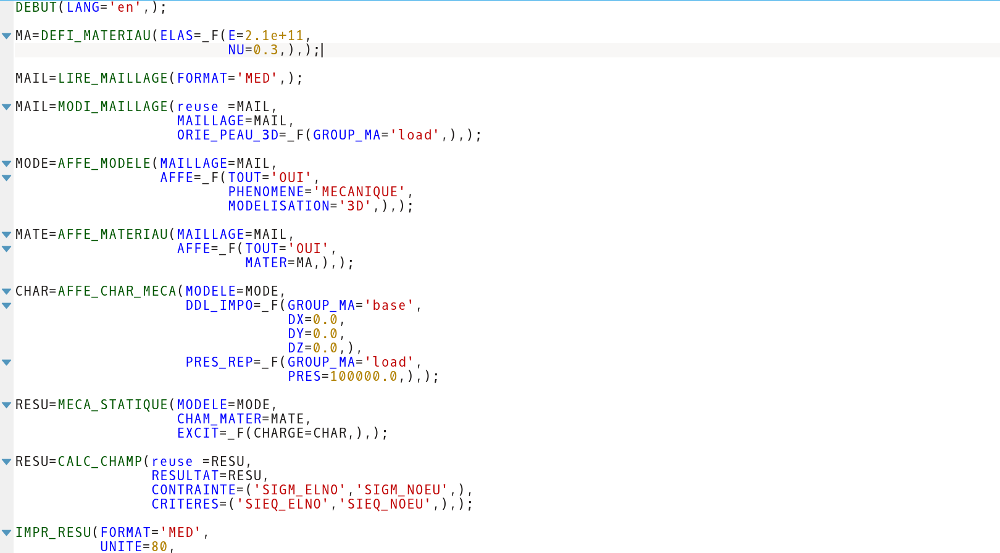

# Code_Aster_Kate_Syntax

Code_aster syntax for Kate, text editor from KDE

# Install instructions

Manual proceed, you need root privilege:

Copy Code_Aster.xml file in:

Option 1: (Work in Linux Mint 18 and Ubuntu 16)

/usr/share/katepart5/syntax/

Option 2:  (Work in Ubuntu 14)

/usr/share/kde4/apps/katepart/syntax/

# Automatic Git update

In construction

# Colaborate instructions

In construction

